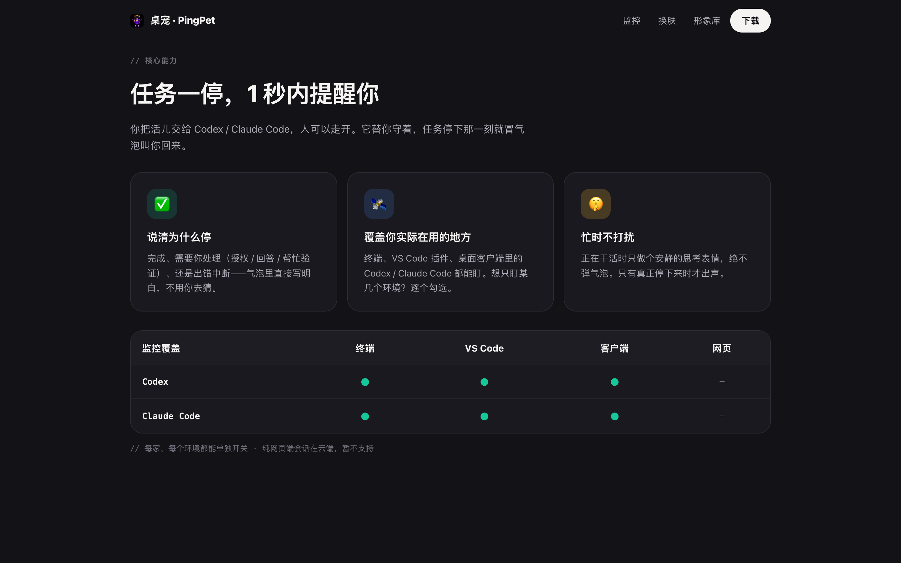
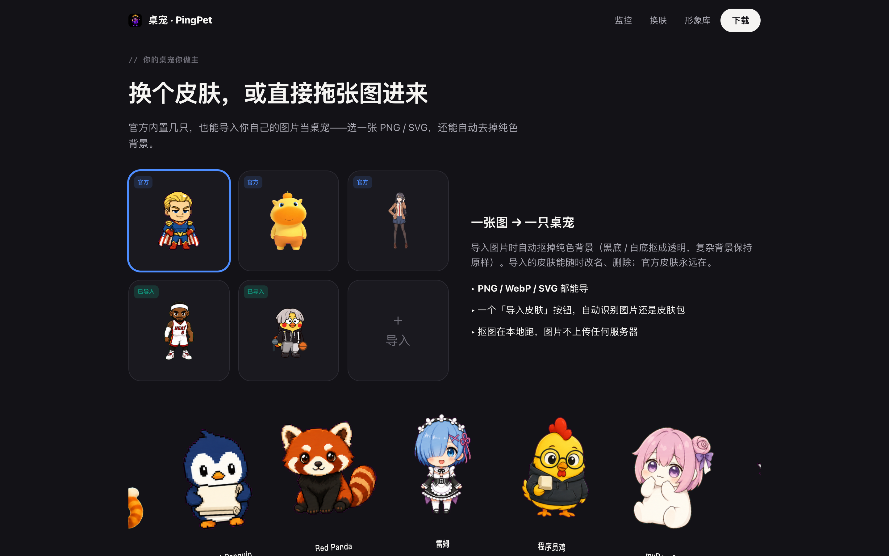
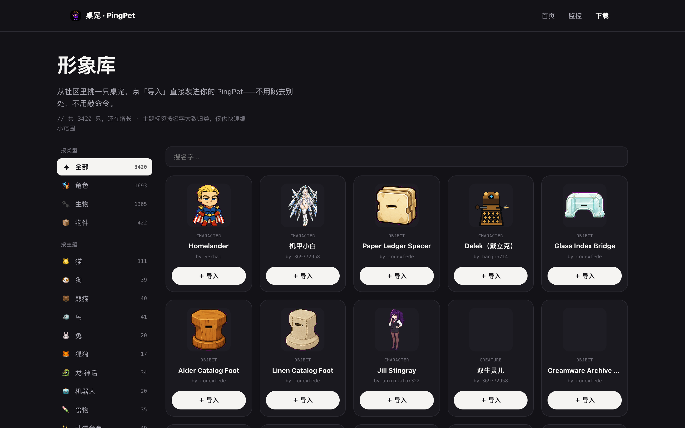
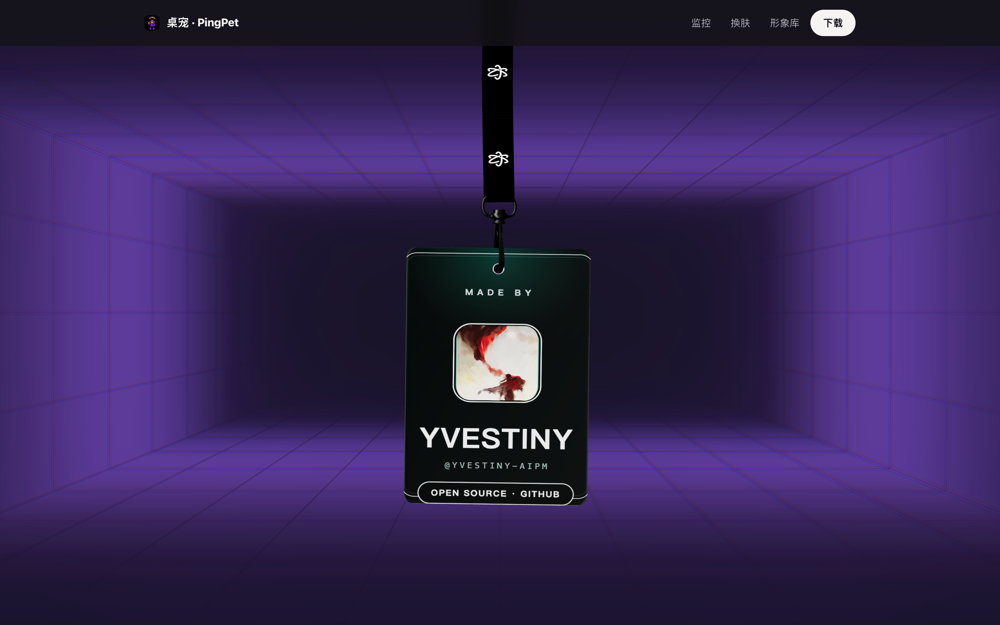

<div align="center">


# PingPet 桌宠

**一只住在 macOS 桌面上的像素小伙伴——替你盯着 Codex / Claude Code，任务一停就叫你回来，忙时绝不打扰。**

[官网](https://yvestiny-aipm.github.io/pingpet/) ·
[⬇️ 下载 macOS 版](https://github.com/Yvestiny-aipm/pingpet/releases/latest/download/PingPet-macOS-arm64.dmg) ·
[形象库（3400+ 社区形象）](https://yvestiny-aipm.github.io/pingpet/gallery.html)


</div>

---

## 这是什么

你把活儿交给 Codex / Claude Code 之后，人往往就走开了——刷会儿手机、倒杯水，回来发现 AI 早就停下来等你确认，白白空转了十几分钟。

PingPet 是一只常驻桌面的透明置顶小桌宠。它安静地趴在屏幕角落，本地监听你机器上的 Codex / Claude Code 会话：**AI 正在干活时它只做一个思考的表情，绝不打扰；任务一停下来，它立刻冒气泡叫你回来，并且说清楚为什么停**（完成了？在等你授权？还是报错中断了？）。

- 🏠 **本地优先**：核心功能纯本地、只读，不联网、不要系统权限、无需账号
- 🪶 **轻量安静**：菜单栏托盘常驻，透明小窗可拖拽，鼠标穿透不挡操作
- 🎨 **可换形象**：官方内置皮肤、一张图导入自动抠背景、兼容 PetDex 社区 3400+ 像素形象一键安装

## 核心功能

### 1. 盯着你的 AI 干活（Agent 监控）



- **监控对象**：Codex 与 Claude Code 的本地会话（终端 CLI、VS Code 插件、桌面客户端里跑的都能盯；纯网页端会话在云端，暂不支持）
- **工作方式**：每 5 秒轮询本机会话记录文件（`~/.codex/sessions`、`~/.claude/projects`），**只读**，不注入、不代理、不改任何东西
- **提醒逻辑**（v0.2.1 起的设计原则：*只在停下时提醒*）：
  - AI 正在干活 → 桌宠切换成「思考中」表情，**不弹气泡**
  - 任务停下 → 弹气泡，并区分四种原因说明白：
    | 停下原因 | 气泡表现 |
    | --- | --- |
    | ✅ 完成 | 「输出结束了，任务完成」 |
    | 🙋 需要你处理 | 授权确认 / 抛出问题 / 请你验证，附上具体原因摘要 |
    | ⚠️ 出错 | 报错停下，附错误摘要 |
    | ⛔ 中断 | 输出被打断 |
- **保守分类**：出错 / 中断优先信显式信号（如 Codex 的 `turn_aborted`），自由文本只用高置信短语判断——宁可漏报，不做狼来了式的误报
- 每家（Codex / Claude Code）、每个环境（终端 / VS Code / 客户端）都能在设置里单独开关

### 2. 换肤：从内置皮肤到「一张图变桌宠」



三种来源，混着用：

- **官方内置**：自带手绘 SVG 小宠物，永远都在
- **一张图 → 一只桌宠**：选一张 PNG / WebP / SVG，纯色背景（黑底 / 白底）自动抠成透明——**抠图在本地跑，图片不上传任何服务器**。导入的皮肤能随时改名、删除
- **皮肤包**：按[皮肤包格式](docs/pet-pack-format.md)组织的目录（多状态素材：idle / happy / thinking / failed…），一键导入

### 3. 形象库：兼容 PetDex 社区生态



PingPet 兼容 [PetDex](https://petdex.dev)（开放的社区桌宠形象库，`pet.json + spritesheet` 格式）：

- [官网形象库](https://yvestiny-aipm.github.io/pingpet/gallery.html)收录全部 **3400+ 只社区形象**，按类型（角色 / 生物 / 物件）和主题（猫、狗、龙、动漫角色…）浏览、搜索
- 看中哪只，点「导入」→ 通过 `deskpet://` 协议直接唤起本机 App 下载安装并切换，不用敲命令、不用手动下载
- App 内同样支持在线浏览安装；用 PetDex CLI 装到 `~/.codex/pets` 的形象也会被自动识别

### 4. 纯本地，越界的事一件都不做


| 维度 | 承诺 |
| --- | --- |
| 网络 | 核心功能从不联网。**唯一**联网的功能是在线形象库，且完全由你主动触发（打开形象库 / 点安装） |
| 你的代码 | 从不读取。只读会话状态文件判断「AI 停没停」 |
| 系统权限 | 零权限。不要辅助功能、不要 AppleScript、不要窗口聚焦 |
| 账号 | 无需注册，没有遥测 |

设置、导入的形象、统计全部留在你的机器上（`~/Library/Application Support/`）。

## 下载安装

- **系统要求**：macOS（Apple Silicon / arm64）
- **下载**：[PingPet-macOS-arm64.dmg](https://github.com/Yvestiny-aipm/pingpet/releases/latest/download/PingPet-macOS-arm64.dmg)（Releases 里永远指向最新版）
- **首次打开**：安装包目前是本地 ad-hoc 签名、未做 Apple 公证，Gatekeeper 可能拦一下——对着 App **右键 →「打开」**，或到「系统设置 → 隐私与安全性」里放行即可
- 小提示：品牌改名进行中，安装后的应用名暂显示为 `DesktopPetMVP`，功能不受影响

## 开发

```bash
pnpm install
pnpm dev        # 开发模式（HMR）
pnpm build      # 类型检查 + 产物构建（out/）
pnpm dist:mac   # 打包 macOS DMG + ZIP（release/）
```

**技术栈**：Electron 33 · electron-vite 3 · React 18 · TypeScript · electron-store · electron-builder · pnpm

**目录结构**：

```
src/
  main/            主进程
    agent/         Agent 监控：会话文件扫描、状态分类、轮询调度
    petPacks/      皮肤包 / 单图导入 / PetDex 在线安装与目录管理
    windows.ts     宠物窗 / 设置窗（透明置顶、跨全屏 Space、边界钳制）
    tray.ts        菜单栏托盘
  preload/         contextBridge 安全桥接（window.petApi）
  renderer/        React UI：宠物视图 + 设置台（hash 路由区分窗口）
  shared/          跨进程共享类型、默认值、宠物元数据
resources/         官方内置皮肤包
landing/           官网静态页（GitHub Pages 部署自 gh-pages 分支）
docs/              皮肤包格式文档、README 截图
build/             应用图标
```

**开发环境注意**：

- pnpm 11 需要在 `pnpm-workspace.yaml` 里允许 electron 的构建脚本（`allowBuilds`）
- 若 shell 环境里有 `ELECTRON_RUN_AS_NODE=1`，启动打包 App 前要 `env -u ELECTRON_RUN_AS_NODE`，否则 Electron 会以纯 Node 模式静默退出
- 测试前先杀掉系统里已安装的正式版实例，避免两个实例并存干扰

## 官网

官网（[yvestiny-aipm.github.io/pingpet](https://yvestiny-aipm.github.io/pingpet/)）本身也是这个仓库的一部分（`landing/`，纯静态、无构建链），上面那些截图就来自它——包括页脚这块可以拖着甩的 3D 开源工牌：



## 路线图

- [ ] Windows 版
- [ ] Developer ID 签名 + 公证 + 自动更新
- [ ] 提醒提示音
- [ ] 点气泡跳回对应终端 / 编辑器
- [ ] 形象社区投稿

## 致谢

- [PetDex](https://petdex.dev)（by crafter-station）——开放的社区桌宠形象生态，形象库里的所有社区形象版权归各自作者
- [PawPause](https://github.com/angziii/pawpause)——同类桌宠项目，产品灵感来源（未使用其代码 / 素材）
- [React Bits](https://reactbits.dev)——官网多个动效（弧形画廊、吊牌、网格扫描、轮换文字）的移植参考

> 开源协议暂未指定。如需转载或二次分发，请先开 issue 沟通。
